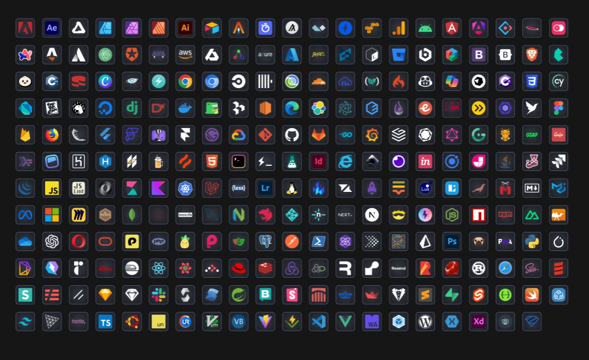

# Tech Icons Generator
Just trying to create a vercel serverless backend which could generate technology icons. Turns out it was fun 😁.


## How to use?
```
https://tech-icons.vercel.app/api/v1?icon=icon_name&size=size_you_need
```

## Demo

| ============= | ============= | ============= | ============= | ============= | ============= | ============= | ============= | ============= | ============= |
| ---------- | ---------------- | ------------ | ------------------ | ----------------- | ------------------ | ------- | --------- | ----------- | --------- |
| <br/>`adobe` | <br/>`ae`           | <br/>`affinity` | <br/>`affinitydesigner` | <br/>`affinityphoto` | <br/>`affinitypublisher` | <br/>`ai`  | <br/>`airtable` | <br/>`alacritty` | <br/>`algolia` |
| <br/>`algorand` | <br/>`alpinejs`     | <br/>`amp`      | <br/>`amznwebserv`    | <br/>`analytics`     | <br/>`android`        | <br/>`angular` | <br/>`angular17` | <br/>`antd`    | <br/>`apache`  |
| <br/>`appwrite` | <br/>`arc`          | <br/>`astro`    | <br/>`atlassian`      | <br/>`atom`          | <br/>`auth0`          | <br/>`avajs` | <br/>`aws`   | <br/>`axiom`   | <br/>`axm`     |
| <br/>`axure`  | <br/>`azure`        | <br/>`babel`    | <br/>`backbonejs`     | <br/>`bash`          | <br/>`bitbucket`      | <br/>`bitnami` | <br/>`blueprintjs` | <br/>`bootstrap4` | <br/>`bootstrap5` |
| <br/>`brave`  | <br/>`bulmaui`      | <br/>`bunjs`    | <br/>`cakephp`        | <br/>`canva`         | <br/>`cassandradb`    | <br/>`chakraui` | <br/>`chrome` | <br/>`chromium` | <br/>`circleci` |
| <br/>`clickhouse` | <br/>`clojure`      | <br/>`cloudflare` | <br/>`cloudinary`     | <br/>`codefresh`     | <br/>`codeigniter`    | <br/>`copilotgithub` | <br/>`copilotms` | <br/>`cpp`     | <br/>`crystal` |
| <br/>`csharp` | <br/>`css3`         | <br/>`cypress`  | <br/>`dart`           | <br/>`datadog`       | <br/>`deno`           | <br/>`digitalocean` | <br/>`django` | <br/>`dlang`   | <br/>`docker`  |
| <br/>`docusaurus` | <br/>`dovetail`     | <br/>`ec2`      | <br/>`edge`           | <br/>`elastic`       | <br/>`electron`       | <br/>`elementui` | <br/>`elixir` | <br/>`ember`   | <br/>`erlang`  |
| <br/>`esbuild` | <br/>`eslint`       | <br/>`faunadb`  | <br/>`figma`          | <br/>`firebase`      | <br/>`firefox`        | <br/>`flask` | <br/>`flutter` | <br/>`flutterflow` | <br/>`flyio`   |
| <br/>`framer` | <br/>`gatsby`       | <br/>`gcloud`   | <br/>`git`            | <br/>`github`        | <br/>`gitlab`         | <br/>`go`    | <br/>`grafana` | <br/>`grafbase` | <br/>`graphite` |
| <br/>`graphql` | <br/>`gridsome`     | <br/>`gruntjs`  | <br/>`gsap`           | <br/>`gulp`          | <br/>`haskell`        | <br/>`headlessui` | <br/>`heroku` | <br/>`hexo`    | <br/>`hhvm`    |
| <br/>`homebrew` | <br/>`hotjar`       | <br/>`html5`    | <br/>`hyper`          | <br/>`hyper2`        | <br/>`i18next`        | <br/>`id`   | <br/>`ie`     | <br/>`inkspace` | <br/>`insomnia` |
| <br/>`invision` | <br/>`ionic`        | <br/>`jamstack` | <br/>`java`           | <br/>`jest`          | <br/>`jira`           | <br/>`jquery` | <br/>`js`     | <br/>`jslint`  | <br/>`json`    |
| <br/>`kibana` | <br/>`kotlin`       | <br/>`kubernetes` | <br/>`laravel`        | <br/>`less`          | <br/>`lightroom`      | <br/>`linux` | <br/>`lit`    | <br/>`liveblocks` | <br/>`logrocket` |
| <br/>`lokalise` | <br/>`lua`          | <br/>`lunacy`   | <br/>`mariadb`        | <br/>`marionette`    | <br/>`markdown`       | <br/>`materialui` | <br/>`meta`   | <br/>`microsoft` | <br/>`miro`    |
| <br/>`mochajs` | <br/>`mongodb`      | <br/>`mongoose` | <br/>`mozilla`        | <br/>`mysql`         | <br/>`neovim`         | <br/>`nestjs` | <br/>`netlify` | <br/>`netlify2` | <br/>`nextjs`  |
| <br/>`nextjs2` | <br/>`nim`          | <br/>`nitro`    | <br/>`nodejs`         | <br/>`npm`           | <br/>`npm2`           | <br/>`nuxtjs` | <br/>`ocaml` | <br/>`onedrive` | <br/>`openai`  |
| <br/>`opera`  | <br/>`oracle`       | <br/>`pandacss` | <br/>`php`            | <br/>`pinia`         | <br/>`pixijs`         | <br/>`playwright` | <br/>`postgresql` | <br/>`postman` | <br/>`powershell` |
| <br/>`preact` | <br/>`presto`       | <br/>`prettier` | <br/>`prisma`         | <br/>`ps`            | <br/>`pugjs`          | <br/>`pwa`   | <br/>`python` | <br/>`pytorch` | <br/>`pytorch3d` |
| <br/>`qwik`   | <br/>`radixui`      | <br/>`rails`    | <br/>`railway`        | <br/>`reactjs`       | <br/>`reactquery`     | <br/>`reactrouter` | <br/>`redhat` | <br/>`redis`   | <br/>`redux`   |
| <br/>`reduxsaga` | <br/>`remix`        | <br/>`render`   | <br/>`resend`         | <br/>`rollup`        | <br/>`ruby`           | <br/>`rust`  | <br/>`safari` | <br/>`sass`    | <br/>`scala`   |
| <br/>`semanticui` | <br/>`serverless`   | <br/>`shadcnui` | <br/>`sketch`         | <br/>`sketch2`       | <br/>`slack`          | <br/>`solidity` | <br/>`solidjs` | <br/>`spring`  | <br/>`storyblok` |
| <br/>`storybook` | <br/>`strada`       | <br/>`stream`   | <br/>`streamlit`      | <br/>`stylelint`     | <br/>`sublime`        | <br/>`supabase` | <br/>`sveltejs` | <br/>`swagger` | <br/>`swift`   |
| <br/>`tailwindcss` | <br/>`threejs`      | <br/>`tinyhttp` | <br/>`tRPC`           | <br/>`typescript`    | <br/>`ubuntu`         | <br/>`unjs`  | <br/>`ur`     | <br/>`vim`     | <br/>`visualbasic` |
| <br/>`vitejs` | <br/>`vitest`       | <br/>`vscode`   | <br/>`vuejs`          | <br/>`webassembly`   | <br/>`webpack`        | <br/>`wordpress` | <br/>`xamarin` | <br/>`xd`      | <br/>`yoga`    |
| <br/>`zod`    |                |              |                    |                   |                    |           |             |             |             |

## Resources
Icons taken from [this figma file](https://www.figma.com/community/file/1095337897898466786/tech-stack-icons-design-stack-icons).